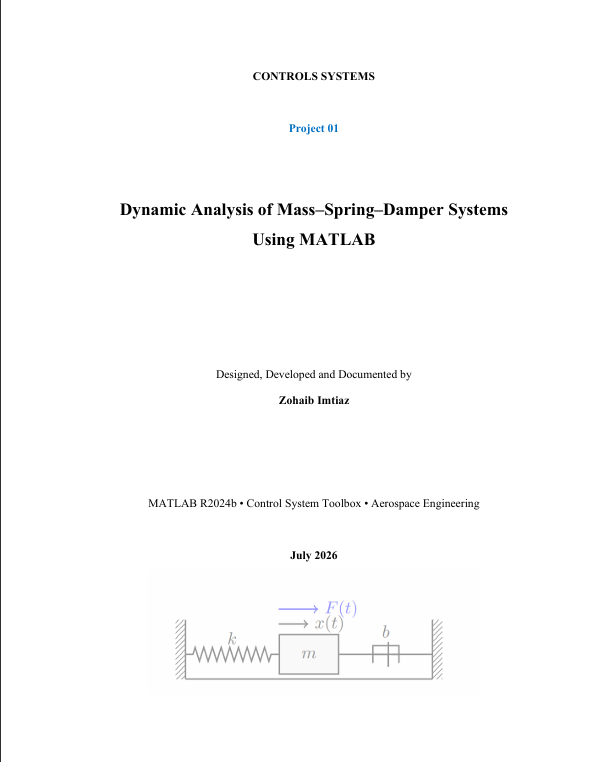
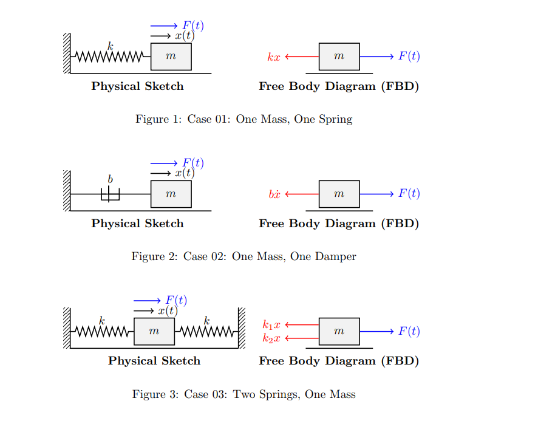
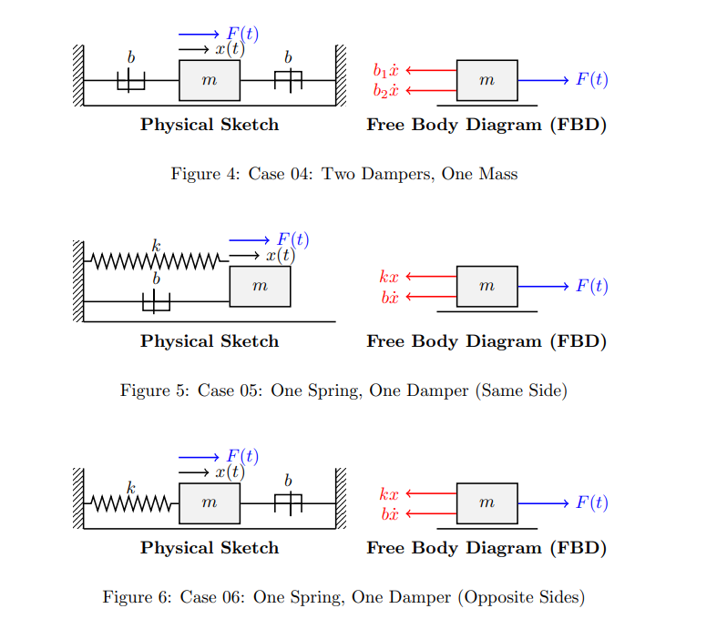

# Dynamic Analysis of Mass–Spring–Damper Systems Using MATLAB

Classical Control Systems | MATLAB | Aerospace Engineering

---

This repository contains my first independent control systems project, focusing on the modeling, analysis, and simulation of mass–spring–damper systems using MATLAB.

## Overview

This project presents a comprehensive dynamic analysis of classical mass–spring–damper systems using MATLAB. Six different mechanical configurations were modeled using transfer functions derived from Newton's Second Law and Laplace transforms.

The study investigates the effect of system parameters—including mass, spring stiffness, and damping coefficient—on transient response, system stability, and overall dynamic behavior. Numerical solutions obtained using MATLAB's ODE45 solver were also compared with analytical transfer-function-based responses to verify the mathematical models.

## Objectives
* Develop mathematical models of mass–spring–damper systems.
* Derive transfer functions for six different configurations.
* Study system dynamics under step and impulse inputs.
* Analyze pole locations and stability.
* Investigate the influence of mass, damping, and spring stiffness on system response.
* Validate the analytical model using MATLAB's ODE45 solver.
* Build a strong foundation in classical control systems for future aerospace applications.
* Project Configurations
  
## System configurations:
The project includes the following system configurations:
* Single Mass–Spring System
* Single Mass–Damper System
* Double Spring System
* Double Damper System
* Mass–Spring–Damper System
* Alternative Mass–Spring–Damper Configuration
    
## Features 
* Transfer Function Modeling
* Step Response Analysis
* Impulse Response Analysis
* Pole Analysis
* Performance Specifications
* ODE45 Numerical Verification
* MATLAB Simulation
  * Step Response Analysis
  * Impulse Response Analysis
* Engineering Report

## Software Used
* MATLAB R2024b
* Control System Toolbox
* Symbolic Math Toolbox

## Future work

* Simulink
* Simscape
* PID Controller Design

**Future Improvements**

This project forms the foundation for future work in classical and modern control systems. Planned extensions include:
* Control Design & Analysis
  * PID controller design and tuning
  * Root locus analysis
  * Frequency response methods
  * State-space modeling
* Aerospace Implementations
  * Aircraft pitch control
  * UAV attitude stabilization
  * Rocket attitude control

## Author
* Zohaib Imtiaz
* Aerospace Engineering Student

## License
This project is released under the MIT License.

## Project Cover

## Cases

